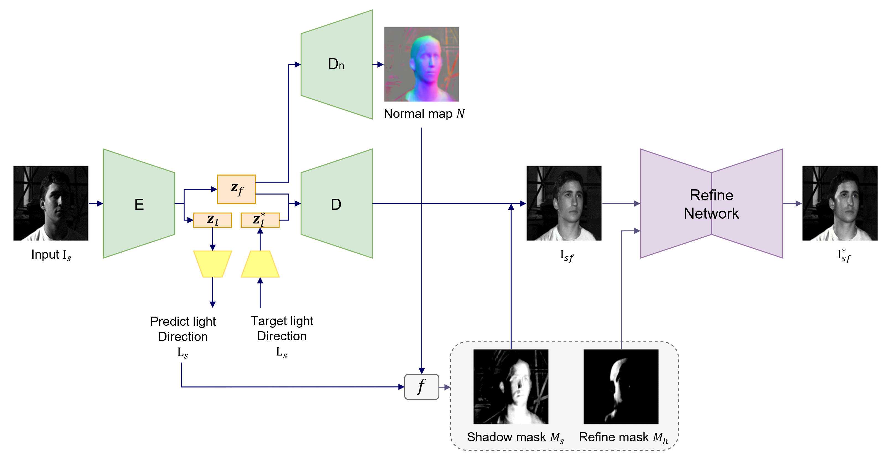

# Face shadow removal

Implementation of face shadow removal.


## Data

The Extended Yale B: The Extended Yale B database contains 2414 frontal-face images with size 192×168 over 38 subjects and about 64 images per subject. The images were captured under different lighting conditions and various facial expressions.

## Model



## Getting started
- Evalution
```
python test.py 
```

- Train
```
python train.py
```
